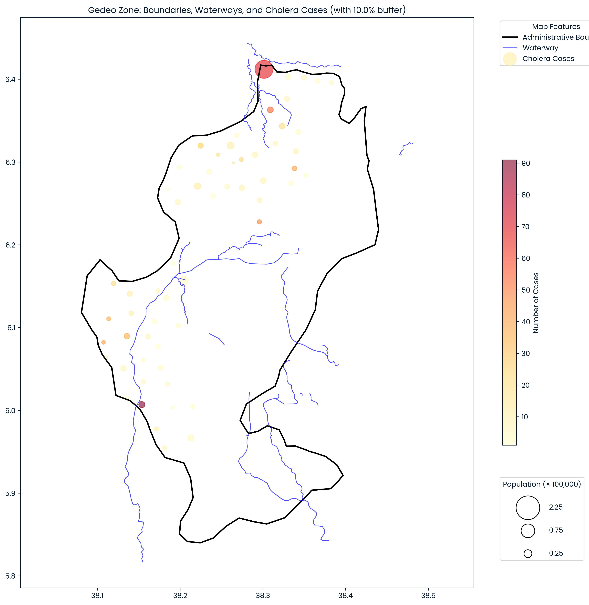

# Integration of Spatial Patterns and Machine Learning for Cholera Risk Assessment in Southern Ethiopia (PART 1)
## _Cholera Spatial Analysis and Exploratory Data Analysis (Gedeo Zone)_

This repository contains a Jupyter notebook that performs an in-depth exploratory data analysis (EDA) and spatial visualization of cholera incidence within the Gedeo Zone. The analysis integrates cholera case data with administrative boundaries and environmental features such as waterways to identify spatial clusters and patterns relevant to public health interventions.

## Overview

The notebook covers:
- Data preparation and cleaning of cholera case records and demographic data.
- Retrieval and processing of geospatial data, including administrative boundaries and waterways from OpenStreetMap.
- Spatial visualization of cholera cases overlaid on the Gedeo Zone map, emphasizing proximity to waterways.
- Identification of cholera clusters and high-risk hotspots.
- Discussion of epidemiological implications and public health intervention strategies.

This analysis provides critical insights into environmental and geographic factors influencing cholera distribution, setting the stage for predictive modeling.

## File Structure

- `cholera_eda_spatial_visualization.ipynb` — Notebook containing the full EDA, data processing, and spatial mapping.
- `images/gedeo_cholera_map.png` — Graphical summary of choropleth map depicting cholera cases, waterways, and boundaries. This plot can be reproduced from the notebook.

## How to Use

1. Clone or download the repository.
2. Install required Python libraries, including `pandas`, `geopandas`, `osmnx`, `matplotlib`, and others as listed in the notebook.
3. Run the notebook sequentially to reproduce the analyses and visualizations.
4. Review the spatial patterns and clusters that emerge from the visualization.

## Next Steps

A complementary notebook focused on machine learning modeling using an XGBoost classifier will follow. This model aims to predict cholera severity to aid healthcare practitioners in risk assessment and management.

---

## Graphical Summary

*Figure: Spatial distribution of cholera cases relative to waterways and administrative boundaries in Gedeo Zone, Ethiopia.*

---

## License

This project is licensed under the MIT License.

## Questions?
Should you have questions or feedback regarding this repository, feel free to send them in at jprmaulion[at]gmail[dot]com. Cheers!
